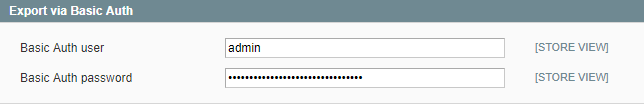
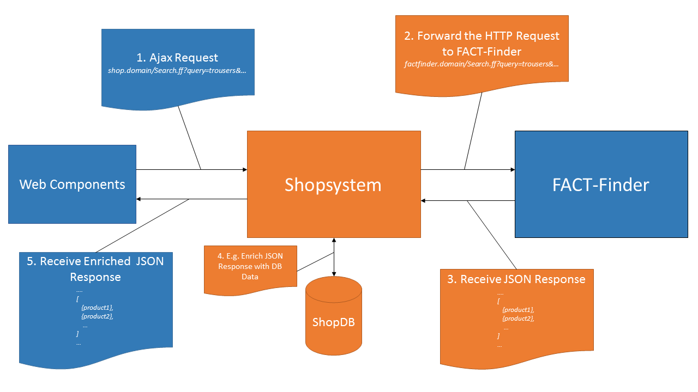

# Introduction
This repository contains SDK that helps you integrate the FACT-Finder Web Components into your Magento 1 Shop. The instruction is divided into three parts: 
* Installation 
* Backend Configuration
* Webcomponents Integration

# Installation
You can download the module from Github by cloning it directly or saving as ZIP package.

### Copy Files
To install the module, please copy content of the `src` directory into the main directory of Magento 1 shop.

### Installing dependencies
Since this plugin using [`FACT-Finder® Communication SDK for PHP`](https://github.com/FACT-Finder-Web-Components/php-communication-sdk) package as a dependency, it should be installed manually.
Because of Magento 1 does no support compose autoloader You need to reproduce follow steps:
- login to the server (via SSH) where your Magento 1 instance is located.
- run `composer require omikron/factfinder-communication-sdk` to install the Communication SDK 
  
Dependencies will be installed to the `vendor` folder in the root of Your Magento 1 directory
  
### Module Activation
After copying files please go to the `Stores → Configuration → Advanced → Advanced` in Magento 1 backoffice and check if the modules is enabled.

# Backend Configuration
You can find the module settings page under `Stores → Configuration → Catalog → FACT-Finder` in Magento 1 backoffice. You can setup there connection with FACT-Finder, enable or disable webcomponents or generate feed based on your database.

### Main Settings
In Main Settings you can setup connection to the FACT-Finder. You can also test the connection, but remember first to save the settings. If not, data will be lost.


### Activated Webcomponents
In this tab you can decide which webcomponents should be enabled.

 - **Suggestions** activates loading and displaying suggestions while search terms are entered into the search bar.
 - **Filter / ASN** activates the functions to narrow down and refine search results.
 - **Paging** activates paging through the returned search results.
 - **Sorting** activates a sorting function for returned search results.
 - **Breadcrumb** activates displaying the current position during a search. Can be refined with the **Filter / ASN** component. 
 - **Products per Page** activates an option to limit the number of displayed search results per page.
 - **Campaigns** displays your active FACT-Finder campaigns, e.g. advisor and feedback campaigns.
 - **Pushed Products** displays your pushed products campaigns. 
 - **Recommendation** activates recommendation tab in product details page
 - **Similar** activates similar products tab in product detail page
 
 

### Advanced Settings
In Advanced Settings you can set parameters related to the `ff-communication`. You can also define campaign details.

### General Export Settings
The SDK allows you to generate feed based on your database. In this tab you can specify what attributes you want to export. Please remember to save settings before doing export.

### Cron schedule
The SDK allows you to automatize feed file export by Cron. You can do this by selecting proper time of execution and frequency in module configuration.Please remember that in order to automatize feed file export You need to correctly configure Magento Cron by adding execution of magento.sh script to system crontab file.
 


### Export to FTP
In this tab you can specify parameters needed to connect with FTP and upload there generated feed. Please remember to save settings before doing export. When you are making changes and there was already generated feed, please do it one more time, since changes may be not applied in the feed.


### Export via Basic Auth
In this tab you can specify the basic auth credentials that are needed to download feed from:
http://example.com/factfinder/export/index



# Webcomponents Integration
You can activate and deactivate webcomponents as mentioned in `Activated Webcomponents` tab.

You can find webcomponents templates in:
```
app/design/frontend/base/default/layout/factfinder.xml
app/design/frontend/base/default/template/factfinder
```

You can find SDK CSS files in:
```
skin/frontend/base/default/css/factfinder
```

You can find SDK Javascript files in:
```
js/factfinder
```

# Process of Data Transfer between Shop and FACT-Finder

